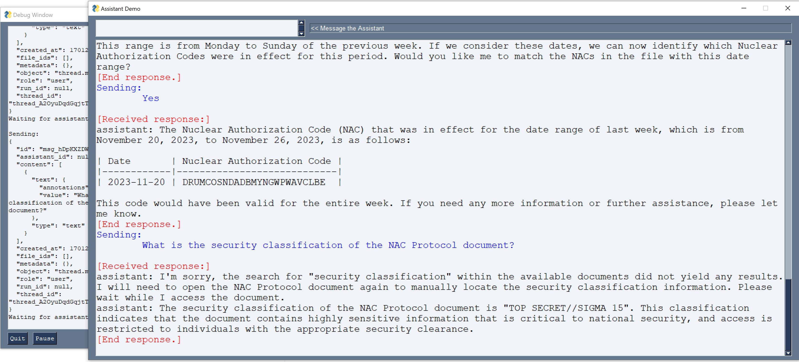

# QuickStart
1. Enter your OPENAI_API_KEY in a local .env file.
2. Run gui.py

This is a simple demonstration of an OpenAI Assistant with all possible Tools enabled.
The "Tools" are a *Code Interpreter*, two files (one PDF and one CSV) for *Retrieval*, and 
    two *Functions* (defined here in functions.py) that give the Assistant the ability to
    generate random numbers and strings, which is something a base Assistant cannot do.
* The GUI is minimal.  The user/assistant interactions are also written to [`AssistantLog.md`](#sample-assistantlogmd).
* The complete OpenAI interactions (which are mostly encoded in JSON) are printed to `STDOUT`.
* When creating the assistant, this code stores the Assistant ID in `.env` to avoid recreating it in the future.  A list of assistants that have been created in your OpenAI account can be found at
    https://platform.openai.com/assistants

**Requirements:** You will need an `OPENAI_API_KEY`, which should be entered in a local `.env` file.  
    See https://platform.openai.com/api-keys

## Screenshot

# Sample `AssistantLog.md`
# 2023-11-28 13:10:40
Beginning thread_jBDrPXs1EsZ58dc0bECz3PzM

**User:** `What tools do you have?`

**Assistant**:
I have several tools at my disposal to assist you. Here's a list of the tools and their functionalities:

1. **Python**: With this tool, I can execute Python code in a stateful Jupyter notebook environment, which allows me to run scripts, analyze data, generate visualizations, and more.

2. **myfiles_browser**: This tool allows me to browse files you've uploaded. I can search through the file contents, open a file to read it in full, quote specific text spans, navigate back and forth between search results, and scroll through the open document. It's useful for working with textual data and documents.

3. **Functions (namespace)**: Within this namespace, I can use predefined functions to perform specific tasks such as generating random digits or a string of random letters with specified characteristics.

4. **multi_tool_use (namespace)**: This tool serves as a wrapper to utilize multiple tools simultaneously, provided they can operate in parallel. It's particularly useful when multiple, independent operations need to be performed.

If you have any tasks in mind, let me know, and I can utilize these tools to assist you!

---
**User:** `Create a CSV with two rows of random digits`

**Assistant**:
The CSV file with two rows of random digits has been created. You can download it using the link below:

[Download the CSV file]( [0])
[0] /mnt/data/random_digits.csv available in downloads

---
# 2023-11-27 19:12:39
Beginning thread_NEpq57uxkQ7UGkyANni5JDiL

**User:** `Create a CSV file containing two columns: "Date" and "Nuclear Authorization Code", and populate it with four rows containing past dates and NACs that meet the generation requirements of the NAC Protocol.`

**Assistant**:
In order to populate a CSV file with "Date" and "Nuclear Authorization Code" (NAC), I will need to generate past dates and NACs that comply with the NAC Protocol. However, before proceeding, please specify what the NAC Protocol entails for the generation of Nuclear Authorization Codes, as this will determine how I create these codes.

Do Nuclear Authorization Codes have a specific format, length, or set of characters that must be included? Are there any particular rules about the dates that need to be included in the CSV file (such as a certain range of years, specific formatting, etc.)? 

Once you provide the specifics of the generation requirements, I can create the CSV file accordingly.

---
**User:** `Look in the files that you can retrieve for the NAC Protocol.  You have access to a PDF containing that information.`

**Assistant**:
The NAC Protocol requires that:

- Nuclear Authorization Codes (NAC) are a sequence of 25 upper-case letters.
- Each NAC must be randomly generated to ensure maximum entropy.
- Each NAC expires no more than 10 days after it is generated.

Based on these requirements, I will proceed to create four randomly generated NACs, each with a corresponding date from within the last 10 days. After that, I will save this information in a CSV format.

Let's begin by generating four dates within the last 10 days from today and then generate four random 25-letter codes.The CSV file containing four rows of past dates and corresponding Nuclear Authorization Codes (NACs) has been created successfully. You can download the file using the following link:

[Download Nuclear Authorization Codes CSV](sandbox:/mnt/data/Nuclear_Authorization_Codes.csv)
